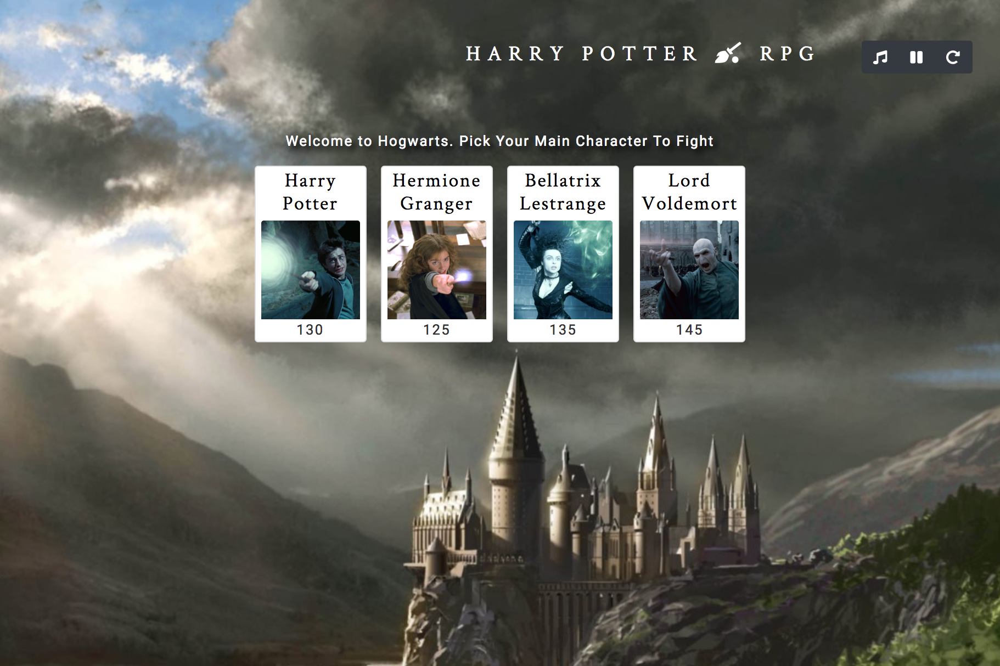
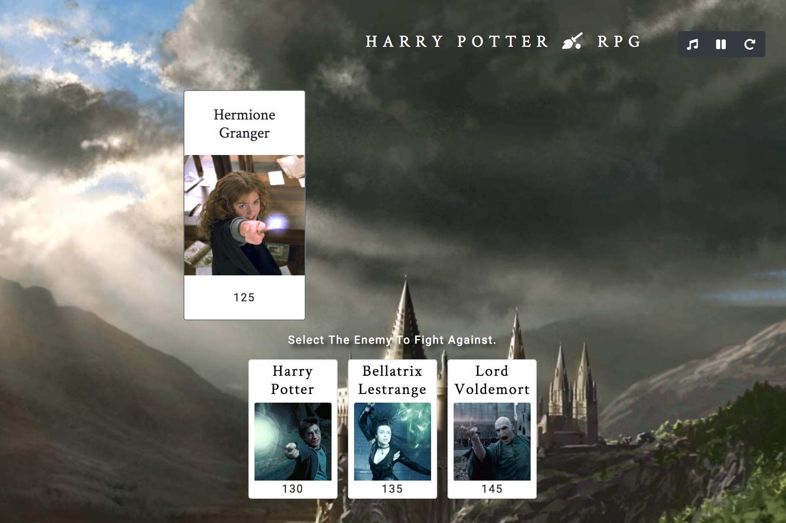
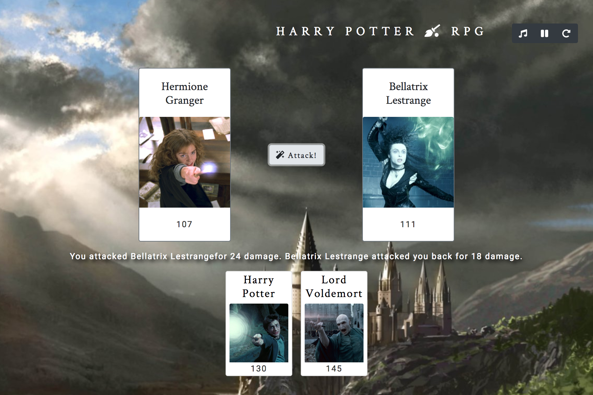
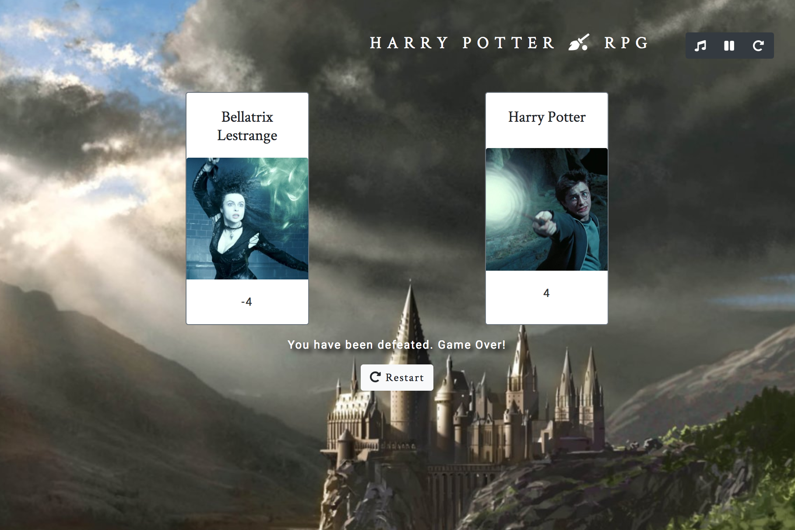
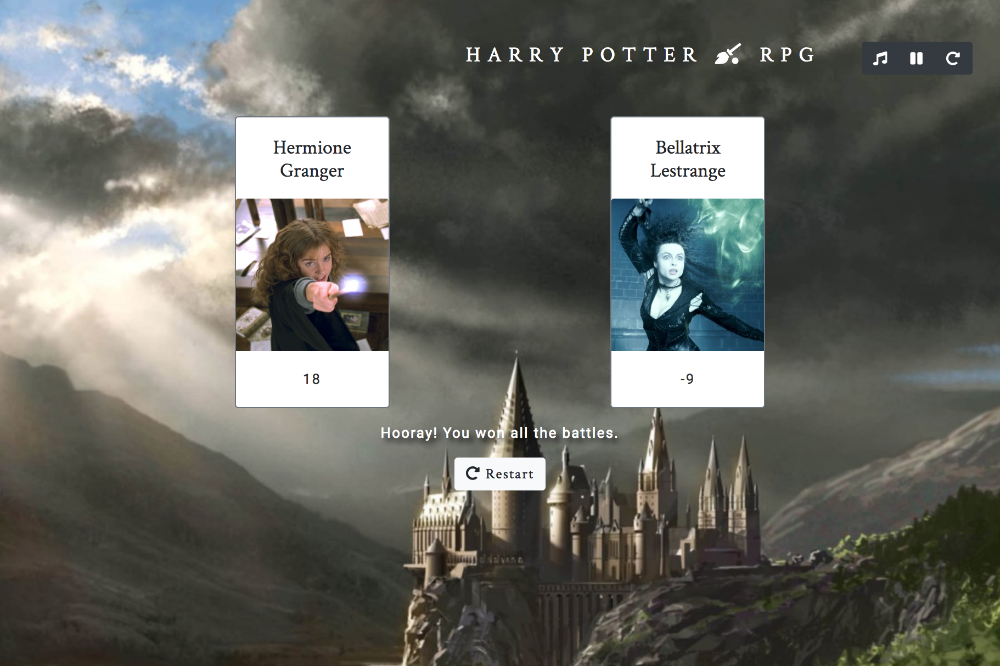

# Harry Potter RPG

---
A web-based jQuery role-playing game (RPG) where the user can control a fictional character from *Harry Potter*. This  game utilizes jQuery to show the user player choices, and let the user pick their player and another player to fight. The user can attack their enemy, and their enemy attacks in return. When health is zero or below for either player, the other player wins.

 [Click to Play](https://keenwilson.github.io/unit-4-game/ "Harry Potter RPG")
---
## How This App Works

* This  game shows the user character choices from *Harry Potter*, and let the user pick their *main character* and *an opponent* to fight by clicking on those characters' pictures.

* The user will fight as that main character for the rest of the game. The user can attack their opponent, and their opponent attacks in return.

* The goal of the game is to defeat all the enemies by fighting them and reducing their HP (hit points) to **zero or below**. 

* At any point if the user's HP is reduced to *zero or below*, the user loses. The game will display a restart button for user to restart the game without refreshing the browser.

* If the user won all the battles, the game will display congratulation messages and show a restart button.

---
## Technical Approach
* Create a clean modern-looking layout with `HTML5` and `CSS Bootstrap` framework
* Use variables, arrays, loops, and conditionals in `JavaScript` to create a simple word guessing game
* Use the `document.onkeyup()` function to collect input from the user's keyboard

---
## Author

[Keen Wilson](https://github.com/keenwilson/keenwilson.github.io "Keen Wilson's Portfolio")

